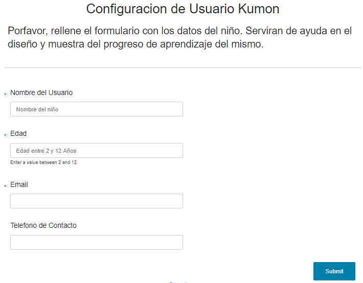
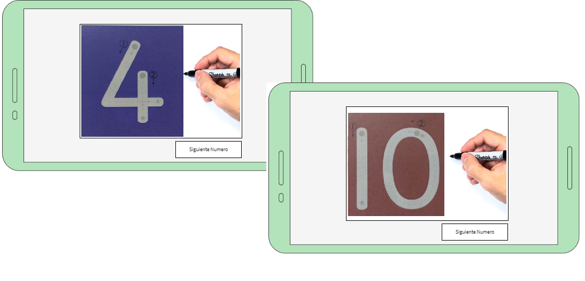
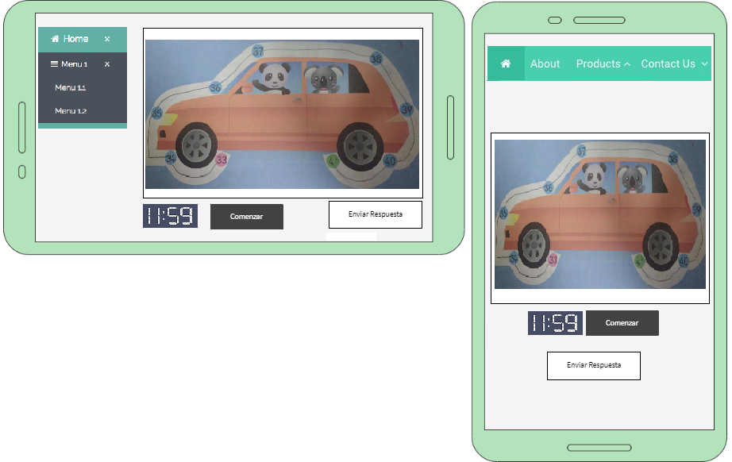

# Proyecto Final PAW

```
El desarrollo de la práctica Integradora de la Asignatura Programación en Ambiente Web
se basará en el diseño y desarrollo de una Aplicación Web (funcional para navegadores
Móvil y de Escritorio).
```

## Presentacion de la Idea 
Fecha: 05/06/2020<br>
### 1)   Propuesta general del sitio a desarrollar en forma de presupuesto funcional y temporal.

Juegos interactivos para niños basados en el Metodo de estudio Kumon <br>
Pagina del Sitio: https://www.kumon.com.ar/metodo-kumon<br>

La escuela busca incentivar en el niño la autonomia a la hora de estudiar buscando fortalecer el potencial de aprendizaje de cada uno. <br>
La idea de la App es crear un aula virtual que emule las practicas individualizadas que la escuela enseña. <br>
Objetivo: Los juegos a recrear son:<br>
a) marcado de numeros del 1 al 9 => para practicar el trazo y direccion de trazado de los numeros<br>
b) trazado de caminos con conteo de numeros entre rangos especificados. <br>

### 2)   Mapa del Sitio, 5 Secciones minimo.

    => home, hablara sobre el metodo de estudio. link con invitacion para empezar a usar el aula virtual. 
    => juegos (aula virtual) 
    => progresos/ estadisticas
    => configuracion de juegos, seran individualizadas por usuario. 
    => configuracion de usuario, nombre rango de edad. En base a eso sera 
    => contacto, formulario de contacto.    

### 3)   Wireframes del sitio web => Home Page, Pagina de cada aplicacion, formularios necesarios para la administracion del sitio.

#### Formulario de configuracion de usuario



#### Vista de juego de los numeros


#### Vista de juego de Trazado de Camino


### 4)   Diseño del Modelo de Objetos


### 5)   Diseño del Modelo de Datos

Los datos a guardar seran: <br>
a) configuracion de cada uno de los caminos, dependiendo de la configuracion del usuario. <br>
    => tabla_config_juego: id_juego, id_configuracion, rango_inicio, rango_final<br>
b) datos del usuario, para individualizar la sesion.<br>
    => tabla_usuario: id_usuario, nombre, contraseña, edad, email<br>
c) estadisticas sobre progreso del niño:<br>
    => tabla_usuario_juego: id_usuario, id_juego, id_configuracion, exitos, fracasos, tiempo. <br>
