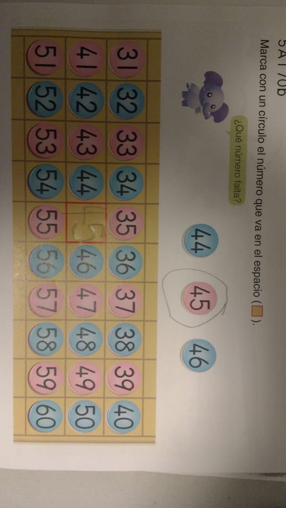

# Proyecto Final PAW

```
El desarrollo de la práctica Integradora de la Asignatura Programación en Ambiente Web
se basará en el diseño y desarrollo de una Aplicación Web (funcional para navegadores
Móvil y de Escritorio).
```

## Presentacion de la Idea 
Fecha: 05/06/2020
1)   Propuesta general del sitio a desarrollar en forma de presupuesto funcional y temporal.

Juegos interactivos para niños basados en el Metodo de estudio Kumon 
Pagina del Sitio: https://www.kumon.com.ar/metodo-kumon

La escuela busca incentivar en el niño la autonomia a la hora de estudiar buscando fortalecer el potencial de aprendizaje de cada uno. 
La idea de la App es crear un aula virtual que emule las practicas individualizadas que la escuela enseña. 
Objetivo: Los juegos a recrear son:
a) marcado de numeros del 1 al 9 => para practicar el trazo y direccion de trazado de los numeros
b) trazado de caminos con conteo de numeros entre rangos especificados. 

2)   Mapa del Sitio => 5 Secciones minimo.
    => home, hablara sobre el metodo de estudio. link con invitacion para empezar a usar el aula virtual. 
    => juegos (aula virtual)
    => progresos/ estadisticas
    => configuracion de juegos, seran individualizadas por usuario. 
    => configuracion de usuario, nombre rango de edad. En base a eso sera 
    => contacto, formulario de contacto. 

3)   Wireframes del sitio web => Home Page, Pagina de cada aplicacion, formularios necesarios para la administracion del sitio.



4)   Diseño del Modelo de Objetos
5)   Diseño del Modelo de Datos

Los datos a guardar seran: 
a) configuracion de cada uno de los caminos, dependiendo de la configuracion del usuario. 
    => tabla_config_juego: id_juego, id_configuracion, rango_inicio, rango_final
b) datos del usuario, para individualizar la sesion.
    => tabla_usuario: id_usuario, nombre, contraseña, edad, email
c) estadisticas sobre progreso del niño:
    => tabla_usuario_juego: id_usuario, id_juego, id_configuracion, exitos, fracasos, tiempo. 
