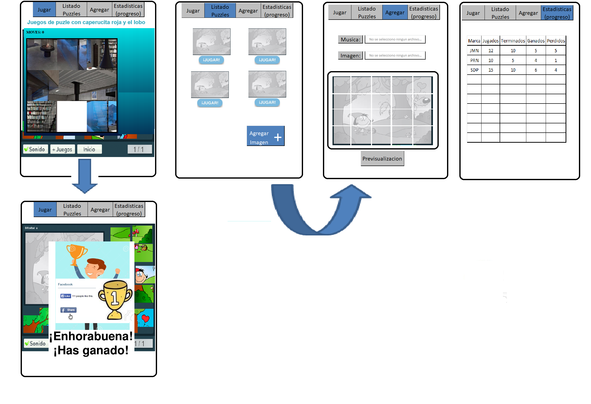
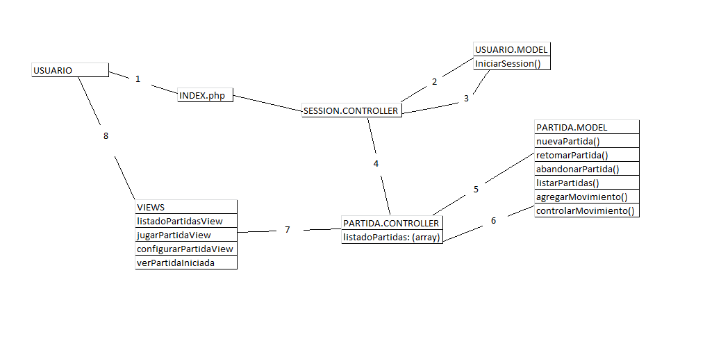
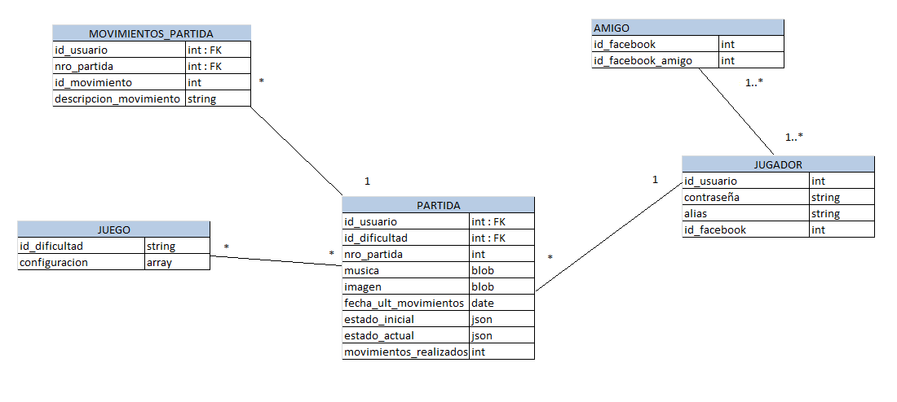
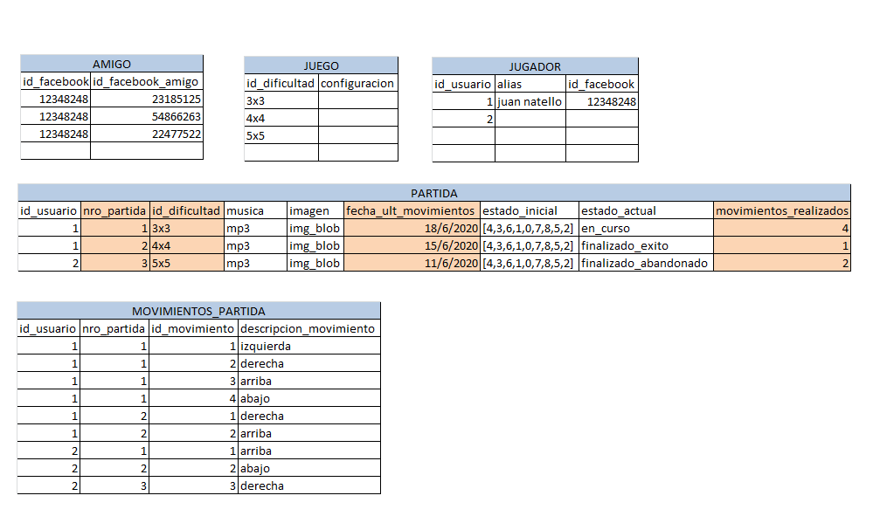

# Proyecto Final PAW

```
El desarrollo de la práctica Integradora de la Asignatura Programación en Ambiente Web
se basará en el diseño y desarrollo de una Aplicación Web (funcional para navegadores
Móvil y de Escritorio).
```

## Presentacion de la Idea 
Fecha: 05/06/2020<br>
### 1)   Propuesta general del sitio a desarrollar en forma de presupuesto funcional y temporal.

Juego Interactivo para el desarrollo del Puzzle

La idea es el desarrollo del Juego clasico de Puzzle, con una interaccion en el BackEnd, mejorando detalles de seguridad. 

#### Costo Total de los recursos Materiales							
Todo el software utilizado es de distribución libre/gratuito, open source. El Software elegido para el desarrollo fue:														
•	PHP 7 (Lenguaje de Programación)						
•	MySQL (Sistema gestor de Bases de Datos)						
•	Apache (Servidor web)
•   JavaScript
•   CSS 3

#### Costo Total del personal	

Para poder considerar el costo Total del Personal se toma en cuenta el costo por hora de un solo integrante ($40 pesos) y se lo multiplica por la cantidad de integrantes del grupo que en nuestro caso es de 1. Luego se lo multiplica por  la cantidad de horas totales de trabajo:

•	Costo por hora total =  $40,00
•	Costo Total del proyecto (horas total x costo)	=  $1800,00

#### Tiempo estimado del proyecto, especificando cómo se ha calculado.

•	Duración total del Proyecto: 	     25 dias (5 semanas x 5 días a la semana)		
•	Duración total del trabajo en horas: 	20 horas semanales (4 horas/día*persona) 


### 2)   Mapa del Sitio, 5 Secciones minimo.

    => home, inicio de session
    => Listado de Partidas Iniciadas
    => Sala de Juego
    => Ranking/ estadisticas.

### 3)   Wireframes del sitio web => Home Page, Pagina de cada aplicacion, formularios necesarios para la administracion del sitio.

#### Formulario de configuracion de usuario

 


### 4)   Diseño del Modelo de Objetos



##### 1) Recepcion del inicio de sesion en la pagina
##### 2) y 3) Una vez logueado en el sistema,  preferentemente con certificado de facebook, comienza la interaccion con la capa controller
##### 4) Pedido de listado de nueva partida
##### 5) Pedido de listado de metodos
##### 6) Envio de resultado al Controlador
##### 7) Envio de parametros a vistas. 
##### 8) Envio de resultado al navegador.


### 5)   Diseño del Modelo de Datos

#### Los datos a guardar seran: 



#### Ejemplo de carga de datos: 



